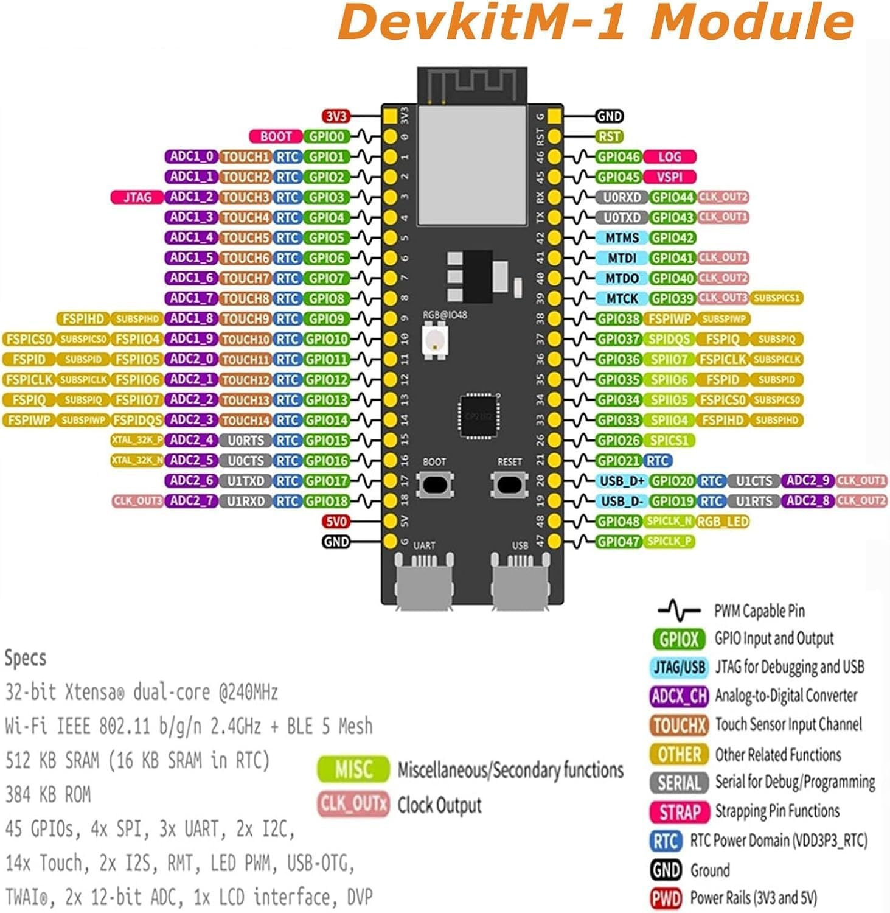
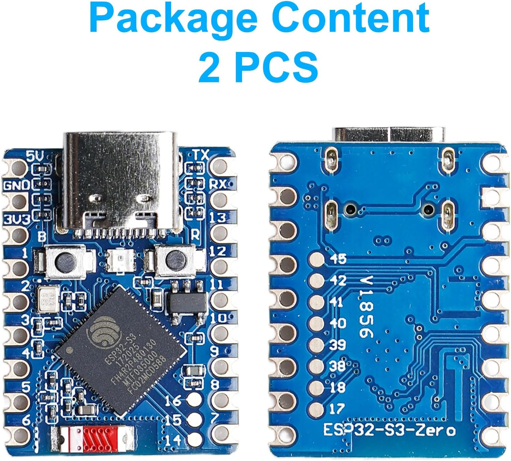

# 📋 Datasheets ESP32-S3 - Hackathon "MQTT Race"

## 🔍 Vue d'ensemble

Pour ce hackathon, nous disposons de **deux versions différentes de l'ESP32-S3** avec des pinouts et des facteurs de forme distincts. Chacune a ses avantages selon l'application visée.


---

## 🔌 Version 1 : ESP32-S3-DevKitM-1 Module



*ESP32-S3-DevKitM-1 Module avec pinout complet*


### 📸 Caractéristiques visuelles
- **Format** : Carte de développement standard (~5.5cm x 2.8cm)
- **Connecteurs** : 2 rangées de pins femelles (format breadboard friendly)
- **Alimentation** : USB-C + broches 3V3/5V/GND
- **Boutons** : BOOT et RESET physiques

### ⚡ Spécifications techniques
- **Processeur** : ESP32-S3 dual-core Xtensa® 32-bit @ 240MHz
- **Mémoire** : 512 KB SRAM (16 KB SRAM in RTC)
- **Flash** : 384 KB ROM
- **Connectivité** : Wi-Fi IEEE 802.11 b/g/n 2.4GHz + BLE 5 Mesh
- **Interfaces** : 45 GPIOs, 4x SPI, 3x UART, 2x I2C
- **Capteurs** : 14x Touch, 2x I2S, RMT, LED PWM, USB-OTG
- **ADC** : 2x 12-bit ADC, 1x LCD interface, DVP

### 🎯 Pinout détaillé (DevKitM-1)

#### Côté gauche (de haut en bas)
| Pin | Fonction | Spécialités |
|-----|----------|-------------|
| 3V3 | Alimentation 3.3V | Sortie régulateur |
| BOOT | Mode de démarrage | Pull-up avec bouton |
| ADC1_0 | GPIO1 | ADC1_CH0, TOUCH1, RTC |
| ADC1_1 | GPIO2 | ADC1_CH1, TOUCH2, RTC |
| ADC1_2 | GPIO3 | ADC1_CH2, TOUCH3, RTC |
| ADC1_3 | GPIO4 | ADC1_CH3, TOUCH4, RTC |
| ADC1_4 | GPIO5 | ADC1_CH4, TOUCH5, RTC |
| ADC1_5 | GPIO6 | ADC1_CH5, TOUCH6, RTC |
| ADC1_6 | GPIO7 | ADC1_CH6, TOUCH7, RTC |
| ADC1_7 | GPIO8 | ADC1_CH7, TOUCH8, RTC |
| ADC1_8 | GPIO9 | ADC1_CH8, TOUCH9, RTC |
| ADC1_9 | GPIO10 | ADC1_CH9, FSPIHD, TOUCH10 |
| ADC2_0 | GPIO11 | ADC2_CH0, TOUCH11, RTC |
| ADC2_1 | GPIO12 | ADC2_CH1, TOUCH12, RTC |
| ADC2_2 | GPIO13 | ADC2_CH2, TOUCH13, RTC |
| ADC2_3 | GPIO14 | ADC2_CH3, TOUCH14, RTC |
| ADC2_4 | GPIO15 | ADC2_CH4, XTAL_32K_P, UARTS |
| ADC2_5 | GPIO16 | ADC2_CH5, XTAL_32K_N, UARTS |
| ADC2_6 | GPIO17 | ADC2_CH6, U1TXD, RTC |
| ADC2_7 | GPIO18 | ADC2_CH7, U1RXD, RTC |
| GND | Masse | Ground |
| 5V | Alimentation 5V | Entrée USB ou externe |

#### Côté droit (de haut en bas)
| Pin | Fonction | Spécialités |
|-----|----------|-------------|
| GND | Masse | Ground |
| RST | Reset | Reset chip |
| GPIO46 | GPIO46 | LOG |
| GPIO45 | GPIO45 | VDD_SPI |
| GPIO44 | GPIO44 | U0RXD, CLK_OUT2 |
| GPIO43 | GPIO43 | U0TXD, CLK_OUT1 |
| GPIO42 | GPIO42 | MTMS |
| GPIO41 | GPIO41 | MTDI, CLK_OUT1 |
| GPIO40 | GPIO40 | MTDO, CLK_OUT2 |
| GPIO39 | GPIO39 | MTCK, CLK_OUT3, SUBSPICS1 |
| GPIO38 | GPIO38 | FSPIWP, SUBSPIWP |
| GPIO37 | GPIO37 | SPIDQS, FSPIQ, SUBSPIHD |
| GPIO36 | GPIO36 | SPIIO7, FSPIHD, SUBSPICS0 |
| GPIO35 | GPIO35 | SPIIO6, FSPID, SUBSPID |
| GPIO34 | GPIO34 | SPIIO5, FSPICS0, SUBSPICS0 |
| GPIO33 | GPIO33 | SPIIO4, FSPIHD, SUBSPIHD |
| GPIO26 | GPIO26 | SPICS1 |
| GPIO21 | GPIO21 | RTC |
| GPIO20 | GPIO20 | USB_D+, RTC, U1CTS, ADC2_9, CLK_OUT1 |
| GPIO19 | GPIO19 | USB_D-, RTC, U1RTS, ADC2_8, CLK_OUT2 |
| GPIO48 | GPIO48 | SPICLK_N, RGB_LED |
| GPIO47 | GPIO47 | SPICLK_P |

---

## 🔌 Version 2 : ESP32-S3-Zero



*ESP32-S3-Zero - Version ultra-compacte*

### 📸 Caractéristiques visuelles
- **Format** : Module ultra-compact (~3.2cm x 2.5cm)
- **Connecteurs** : Pads de soudure + quelques pins déportés
- **Alimentation** : USB-C + pads 3V3/GND
- **Facteur de forme** : Très compact, idéal pour intégrations serrées

### ⚡ Spécifications techniques
**Identiques à la DevKitM-1** mais avec un pinout réduit :
- Même processeur ESP32-S3
- Même connectivité Wi-Fi + BLE
- Nombre de GPIOs exposés **limité** (environ 20-25 pins)

### 🎯 Pinout détaillé (ESP32-S3-Zero)

#### Pins exposés (visibles sur l'image)
| Pin | Fonction | Position |
|-----|----------|----------|
| 5V | Alimentation 5V | Coin supérieur gauche |
| GND | Masse | Multiple emplacements |
| 3V3 | Alimentation 3.3V | Côté alimentation |
| TX | UART TX | Communication série |
| RX | UART RX | Communication série |
| 1-13 | GPIO1 à GPIO13 | Numérotés sur le pourtour |
| 14 | GPIO14 | Côté inférieur |
| 15 | GPIO15 | Côté inférieur |
| 16 | GPIO16 | Côté droit |
| 17 | GPIO17 | Côté droit |
| 18 | GPIO18 | Côté droit |
| 39 | GPIO39 | Côté droit |
| 38 | GPIO38 | Côté droit |
| 37 | GPIO37 | Côté droit |

> **Note importante** : La ESP32-S3-Zero expose moins de pins que la DevKitM-1, limitant les options de connexion.

---

## ⚖️ Comparaison et Recommandations


## 🛠️ Conseils pratiques pour le hackathon


### ⚡ Configuration Arduino IDE

Peu importe la version, la configuration est identique :

```cpp
// Configuration boards.txt - identique pour les deux
Board: "ESP32S3 Dev Module"
Upload Speed: "921600"
CPU Frequency: "240MHz (WiFi/BT)"
Flash Mode: "QIO"
Flash Size: "4MB (32Mb)"
Partition Scheme: "Default 4MB with spiffs"
PSRAM: "Disabled"
```

---

## 🔄 Chapitre spécial : Compatibilité PCB Universelle

### 🎯 Objectif : PCB Compatible avec les Deux Modules

Pour maximiser la flexibilité du projet, il est possible de concevoir un PCB qui accepte **indifféremment** l'ESP32-S3-DevKitM-1 ou l'ESP32-S3-Zero. Voici l'analyse de compatibilité :

### 📌 Pins Communs Essentiels

| Pin | DevKitM-1 | S3-Zero | Fonction | Accessibilité S3-Zero | Note |
|-----|-----------|---------|----------|----------------------|------|
| **3V3** | ✅ | ✅ | Alimentation 3.3V | 🟢 **Pourtour** | Pad facilement accessible |
| **GND** | ✅ | ✅ | Masse | 🟢 **Pourtour** | Multiple emplacements |
| **5V** | ✅ | ✅ | Alimentation 5V | 🟢 **Pourtour** | Coin supérieur |
| **TX** | ✅ | ✅ | UART TX (GPIO43) | 🟢 **Pourtour** | Communication série |
| **RX** | ✅ | ✅ | UART RX (GPIO44) | 🟢 **Pourtour** | Communication série |
| **GPIO1** | ✅ | ✅ | GPIO/ADC1_CH0/TOUCH1 | 🟢 **Pourtour** | Pin #1, accessible |
| **GPIO2** | ✅ | ✅ | GPIO/ADC1_CH1/TOUCH2 | 🟢 **Pourtour** | Pin #2, accessible |
| **GPIO3** | ✅ | ✅ | GPIO/ADC1_CH2/TOUCH3 | 🟢 **Pourtour** | Pin #3, accessible |
| **GPIO4** | ✅ | ✅ | GPIO/ADC1_CH3/TOUCH4 | 🟢 **Pourtour** | Pin #4, accessible |
| **GPIO5** | ✅ | ✅ | GPIO/ADC1_CH4/TOUCH5 | 🟢 **Pourtour** | Pin #5, accessible |
| **GPIO6** | ✅ | ✅ | GPIO/ADC1_CH5/TOUCH6 | 🟢 **Pourtour** | Pin #6, accessible |
| **GPIO7** | ✅ | ✅ | GPIO/ADC1_CH6/TOUCH7 | 🟢 **Pourtour** | Pin #7, accessible |
| **GPIO8** | ✅ | ✅ | GPIO/ADC1_CH7/TOUCH8 | 🟢 **Pourtour** | Pin #8, accessible |
| **GPIO9** | ✅ | ✅ | GPIO/ADC1_CH8/TOUCH9 | 🟢 **Pourtour** | Pin #9, accessible |
| **GPIO10** | ✅ | ✅ | GPIO/ADC1_CH9/FSPIHD | 🟢 **Pourtour** | Pin #10, accessible |
| **GPIO11** | ✅ | ✅ | GPIO/ADC2_CH0/TOUCH11 | 🟡 **Soudure** | Pin #11, nécessite soudure |
| **GPIO12** | ✅ | ✅ | GPIO/ADC2_CH1/TOUCH12 | 🟡 **Soudure** | Pin #12, nécessite soudure |
| **GPIO13** | ✅ | ✅ | GPIO/ADC2_CH2/TOUCH13 | 🟢 **Pourtour** | Pin #13, accessible |
| **GPIO14** | ✅ | ✅ | GPIO14 | 🟢 **Pourtour** | Pin #14, accessible |
| **GPIO15** | ✅ | ✅ | GPIO15 | 🟢 **Pourtour** | Pin #15, accessible |
| **GPIO16** | ✅ | ✅ | GPIO16 | 🟢 **Pourtour** | Pin #16, accessible |
| **GPIO17** | ✅ | ✅ | GPIO17/U1TXD | 🟢 **Pourtour** | Pin #17, accessible |
| **GPIO18** | ✅ | ✅ | GPIO18/U1RXD | 🟢 **Pourtour** | Pin #18, accessible |
| **GPIO39** | ✅ | ✅ | GPIO39/MTCK | 🟢 **Pourtour** | Pin #39, accessible |
| **GPIO38** | ✅ | ✅ | GPIO38/FSPIWP | 🟢 **Pourtour** | Pin #38, accessible |
| **GPIO37** | ✅ | ✅ | GPIO37/SPIDQS | 🟢 **Pourtour** | Pin #37, accessible |

### 🔍 Légende Accessibilité S3-Zero
- 🟢 **Pourtour** : Pin accessible via pad de soudure sur le bord du module (facile)
- 🟡 **Soudure** : Pin nécessitant une soudure manuelle avec fil (technique)
- 🔴 **Interne** : Pin non accessible (réservé ou interne)

### ⚠️ Note Importante pour PCB Compatible
**Les pins du pourtour** de l'ESP32-S3-Zero sont **facilement accessibles** pour connexion directe sur PCB ou via connecteurs. **Les pins centrales** (comme GPIO11, GPIO12) nécessitent une **soudure manuelle** avec des fils fins, ce qui les rend moins pratiques pour un usage en hackathon.

**Recommandation** : Privilégier les **pins 1-10, 13-18, 37-39** qui sont sur le pourtour pour un design PCB universel.

### ⚠️ Pins Non Communs (DevKitM-1 uniquement)

| Pin | Fonction | Alternative S3-Zero |
|-----|----------|---------------------|
| GPIO19-48 | GPIOs étendus | Utiliser pins communes |
| Pins spécialisés | JTAG, USB, etc. | Fonctions de base uniquement |

---

## 📚 Ressources et liens utiles

- [Documentation officielle ESP32-S3](https://docs.espressif.com/projects/esp-idf/en/latest/esp32s3/)
- [Pinout détaillé ESP32-S3](https://randomnerdtutorials.com/esp32-s3-pinout-reference/)
- [Arduino ESP32 Core](https://github.com/espressif/arduino-esp32)
- [Exemples MQTT pour ESP32-S3](https://github.com/espressif/arduino-esp32/tree/master/libraries/WiFi/examples)

---

