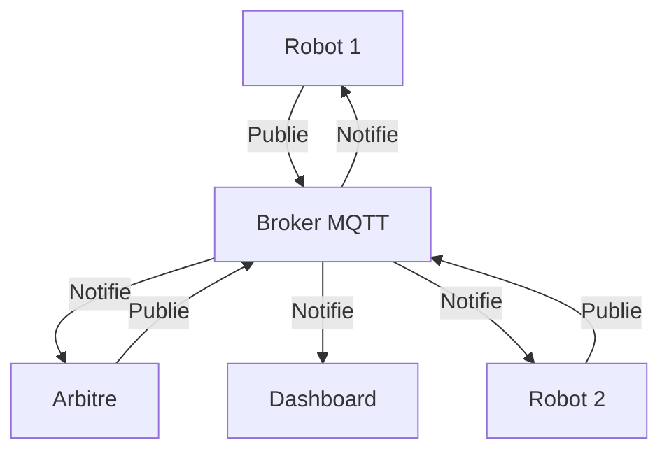

# 📡 MQTT : Le Protocole de l'Internet des Objets

## 🔍 Introduction : MQTT et l'IoT

MQTT (Message Queuing Telemetry Transport) est un protocole de messagerie légère conçu pour les communications Machine-to-Machine (M2M) dans le monde de l'**Internet des Objets** (IoT). Créé initialement par IBM dans les années 1990 pour surveiller les pipelines pétroliers dans le désert, il est aujourd'hui devenu l'un des standards les plus utilisés dans l'écosystème IoT.

Dans le contexte de notre hackathon "MQTT Race", ce protocole sera la **colonne vertébrale de communication** entre vos robots et le système central, permettant le démarrage synchronisé des courses, le chronométrage, et l'interaction en temps réel avec vos créations.

> "MQTT est à l'IoT ce que HTTP est au Web : un langage universel permettant aux machines de communiquer efficacement."

---

## 🧩 Concepts Fondamentaux de MQTT

### Le modèle Publish/Subscribe

Contrairement aux protocoles traditionnels client-serveur, MQTT utilise un modèle **publish/subscribe** (publication/abonnement) :



**Avantages de ce modèle :**
- **Découplage spatial** : les expéditeurs et destinataires n'ont pas besoin de connaître l'existence ou l'emplacement des autres
- **Asynchronisme** : les émetteurs et récepteurs peuvent opérer indépendamment
- **Scalabilité** : facilement adaptable à de nombreux appareils

### Les composants clés

1. **Broker MQTT** : le "hub central" qui reçoit tous les messages, maintient les abonnements et distribue les messages
2. **Client MQTT** : tout appareil qui se connecte au broker pour publier et/ou recevoir des messages (vos robots, le système d'arbitrage, le dashboard...)
3. **Topic** : chemin hiérarchique (comme une URL) qui définit un canal de communication
4. **Message** : données transmises, avec des options de QoS (Quality of Service)

### Quality of Service (QoS)

MQTT propose trois niveaux de garantie de livraison :
- **QoS 0** : "Au plus une fois" - Message envoyé sans confirmation (fire and forget)
- **QoS 1** : "Au moins une fois" - Confirmation de réception, peut entraîner des doublons
- **QoS 2** : "Exactement une fois" - Système à 4 étapes garantissant une livraison unique

Pour notre hackathon, nous utiliserons principalement **QoS 1** pour garantir que les messages critiques (départ, arrivée) sont bien transmis.

---

## 💡 Pourquoi MQTT est idéal pour l'IoT et notre hackathon

1. **Léger et économe en énergie** : parfait pour les appareils contraints comme l'ESP32
2. **Faible bande passante** : fonctionne même avec des connexions limitées
3. **Communication bidirectionnelle** : permet le contrôle et la surveillance des robots
4. **Fiabilité** : mécanismes intégrés pour gérer les déconnexions
5. **Standardisé** : compétence transférable à de nombreux projets IoT
6. **Temps réel** : latence minimale, essentielle pour le chronométrage des courses

---

## 🌳 Conception des Topics MQTT

Un topic MQTT est une chaîne de caractères qui définit un "canal" de communication. Sa structure est hiérarchique, utilisant le slash (`/`) comme séparateur, semblable à une URL.

### Structure recommandée pour notre hackathon

```
hackathon/mqtt_race/<action>/<team_name>
```

**Exemples de topics :**

| Topic | Description |
|-------|-------------|
| `hackathon/mqtt_race/registration/TeamAlpha` | Robot "TeamAlpha" signale qu'il est prêt |
| `hackathon/mqtt_race/start/TeamAlpha` | Signal de départ pour "TeamAlpha" |
| `hackathon/mqtt_race/finish/TeamAlpha` | "TeamAlpha" a franchi la ligne d'arrivée |
| `hackathon/mqtt_race/stop/TeamAlpha` | Ordre d'arrêt d'urgence pour "TeamAlpha" |
| `hackathon/mqtt_race/telemetry/TeamAlpha` | Données capteurs du robot "TeamAlpha" |

### Bonnes pratiques

- Utilisez une structure cohérente et lisible
- Évitez les caractères spéciaux (sauf `/`, `+`, `#`)
- Utilisez le joker `+` pour un niveau (ex: `hackathon/mqtt_race/finish/+`)
- Utilisez le joker `#` pour plusieurs niveaux (ex: `hackathon/mqtt_race/#`)
- Préférez les topics courts pour réduire la charge réseau

---

## 🚦 Cycle de vie d'une course avec MQTT

Voici comment se déroule une course typique via MQTT :

1. **Enregistrement** : Chaque robot publie un message sur `hackathon/mqtt_race/registration/<team_name>` lorsqu'il est prêt sur la ligne de départ

2. **Attente** : Les robots s'abonnent à `hackathon/mqtt_race/start/<team_name>` et attendent le signal de départ

3. **Départ** : Le système d'arbitrage publie un message sur `hackathon/mqtt_race/start/<team_name>` pour chaque robot

4. **Course** : Pendant la course, les robots peuvent :
   - Publier des données de télémétrie
   - Écouter les commandes d'urgence
   - Réagir aux événements du circuit

5. **Arrivée** : À la fin, chaque robot publie sur `hackathon/mqtt_race/finish/<team_name>` pour arrêter le chronomètre

6. **Résultats** : Les temps sont automatiquement calculés et publiés sur `hackathon/mqtt_race/results`

---

## 💻 Implémentation MQTT avec ESP32

L'ESP32 est parfaitement adapté pour communiquer via MQTT. Plusieurs bibliothèques sont disponibles :

### Bibliothèque recommandée : PubSubClient

```cpp
#include <WiFi.h>
#include <PubSubClient.h>

// Paramètres WiFi
const char* ssid = "Hackathon_Network";
const char* password = "password";

// Paramètres MQTT
const char* mqtt_server = "broker.local"; // Adresse du broker
const int mqtt_port = 1883;
const char* mqtt_team = "TeamAlpha";

WiFiClient espClient;
PubSubClient client(espClient);

// Buffer pour les messages
char msg[50];

void setup_wifi() {
  // Connexion WiFi
  WiFi.begin(ssid, password);
  while (WiFi.status() != WL_CONNECTED) {
    delay(500);
    Serial.print(".");
  }
  Serial.println("WiFi connected");
}

void callback(char* topic, byte* payload, unsigned int length) {
  // Traitement des messages reçus
  String message;
  for (int i = 0; i < length; i++) {
    message += (char)payload[i];
  }
  
  // Exemple de traitement du signal de départ
  if (String(topic) == "hackathon/mqtt_race/start/" + String(mqtt_team)) {
    // Démarrer le robot
    startRobot();
  }
}

void reconnect() {
  // Boucle jusqu'à reconnexion
  while (!client.connected()) {
    if (client.connect(mqtt_team)) {
      // Abonnement aux topics pertinents
      client.subscribe(("hackathon/mqtt_race/start/" + String(mqtt_team)).c_str());
      client.subscribe(("hackathon/mqtt_race/stop/" + String(mqtt_team)).c_str());
      
      // Publication message de registration
      client.publish(
        ("hackathon/mqtt_race/registration/" + String(mqtt_team)).c_str(), 
        "ready"
      );
    } else {
      delay(5000);
    }
  }
}

void setup() {
  Serial.begin(115200);
  setup_wifi();
  client.setServer(mqtt_server, mqtt_port);
  client.setCallback(callback);
}

void loop() {
  // Gestion de la connexion MQTT
  if (!client.connected()) {
    reconnect();
  }
  client.loop();
  
  // Votre code de suivi de ligne ici...
  
  // Si ligne d'arrivée détectée
  if (finishLineDetected()) {
    client.publish(
      ("hackathon/mqtt_race/finish/" + String(mqtt_team)).c_str(), 
      "finished"
    );
  }
}
```

### Fonctions MQTT essentielles à connaître

| Fonction | Description |
|----------|-------------|
| `client.connect()` | Établit la connexion avec le broker |
| `client.publish(topic, message)` | Publie un message sur un topic |
| `client.subscribe(topic)` | S'abonne à un topic |
| `client.setCallback(callback_function)` | Définit la fonction appelée à réception d'un message |
| `client.loop()` | Maintient la connexion et traite les messages |

---

## 📊 Visualisation et debug avec MQTT

Pour développer et tester votre système, quelques outils utiles :

### MQTT Explorer
Application de bureau permettant de visualiser tous les messages MQTT en temps réel.


### Node-RED
Outil de développement visuel pour interconnecter des appareils IoT.

```javascript
// Exemple de fonction Node-RED pour le chronométrage
var startTime = {};

if (msg.topic.includes('/registration/')) {
    var team = msg.topic.split('/').pop();
    return { 
        payload: "Team " + team + " ready!", 
        team: team 
    };
}

if (msg.topic.includes('/start/')) {
    var team = msg.topic.split('/').pop();
    startTime[team] = new Date();
    return { 
        payload: "Team " + team + " started!", 
        team: team 
    };
}

if (msg.topic.includes('/finish/')) {
    var team = msg.topic.split('/').pop();
    if (startTime[team]) {
        var endTime = new Date();
        var raceTime = (endTime - startTime[team]) / 1000;
        return { 
            payload: "Team " + team + " finished in " + raceTime + "s", 
            team: team, 
            time: raceTime 
        };
    }
}
```

---

## 🔧 Conseils pratiques pour le hackathon

1. **Testez votre connexion MQTT dès le début** - Une bonne communication est la base de tout
2. **Gérez les déconnexions** - Que fait votre robot s'il perd la connexion ?
3. **Minimisez les données** - N'envoyez que ce qui est nécessaire
4. **Utilisez des Last Will and Testament (LWT)** - Messages automatiques envoyés si votre robot se déconnecte
5. **Structurez vos données** - Utilisez JSON pour les messages complexes :
   ```json
   {
     "team": "TeamAlpha",
     "sensors": {
       "left": 245,
       "center": 512,
       "right": 198
     },
     "speed": 75,
     "battery": 3.7
   }
   ```

## 📚 Ressources complémentaires

- [Documentation officielle de MQTT](https://mqtt.org/)
- [Tutoriel MQTT avec ESP32](https://randomnerdtutorials.com/esp32-mqtt-publish-subscribe-arduino-ide/)
- [Guide des bonnes pratiques MQTT](https://www.hivemq.com/blog/mqtt-essentials-part-5-mqtt-topics-best-practices/)
- [Bibliothèque PubSubClient](https://github.com/knolleary/pubsubclient)

---

## 🏁 Conclusion

MQTT est un protocole puissant et flexible qui forme le cœur de la communication dans notre hackathon. Sa simplicité apparente cache une grande polyvalence qui vous permettra de créer des interactions sophistiquées entre vos robots, le système d'arbitrage et potentiellement entre les robots eux-mêmes.

Maîtriser MQTT n'est pas seulement utile pour ce hackathon - c'est une compétence précieuse dans tout l'écosystème IoT, des maisons intelligentes aux applications industrielles.

Alors, prêts à publier vos premiers messages ? 🚀