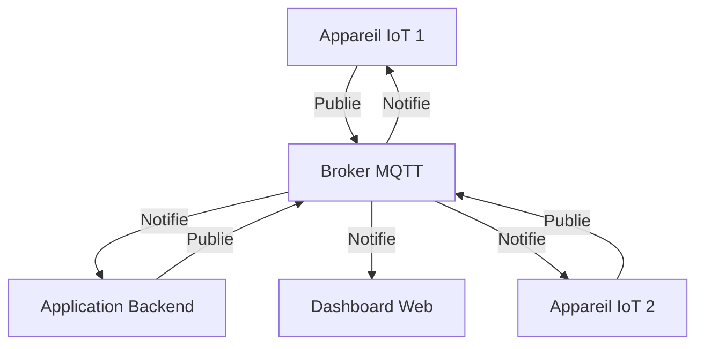

# 📡 MQTT : Le Protocole de l'Internet des Objets

## 🔍 Introduction : MQTT et l'IoT

MQTT (Message Queuing Telemetry Transport) est un protocole de messagerie légère conçu pour les communications Machine-to-Machine (M2M) dans le monde de l'**Internet des Objets** (IoT). Créé initialement par IBM dans les années 1990 pour surveiller les pipelines pétroliers dans le désert, il est aujourd'hui devenu l'un des standards les plus utilisés dans l'écosystème IoT.

Ce protocole est particulièrement adapté aux environnements où la bande passante est limitée, où les ressources des appareils sont contraintes, ou où la connexion réseau peut être instable.

> "MQTT est à l'IoT ce que HTTP est au Web : un langage universel permettant aux machines de communiquer efficacement."

---

## 🧩 Concepts Fondamentaux de MQTT

### Le modèle Publish/Subscribe

Contrairement aux protocoles traditionnels client-serveur, MQTT utilise un modèle **publish/subscribe** (publication/abonnement) :


```mermaid
graph TD
    A[Appareil IoT 1] -->|Publie| B[Broker MQTT]
    C[Appareil IoT 2] -->|Publie| B
    B -->|Notifie| D[Application Backend]
    B -->|Notifie| E[Dashboard Web]
    D -->|Publie| B
    B -->|Notifie| A
    B -->|Notifie| C
```

**Avantages de ce modèle :**
- **Découplage spatial** : les expéditeurs et destinataires n'ont pas besoin de connaître l'existence ou l'emplacement des autres
- **Asynchronisme** : les émetteurs et récepteurs peuvent opérer indépendamment
- **Scalabilité** : facilement adaptable à de nombreux appareils

### Les composants clés

1. **Broker MQTT** : le "hub central" qui reçoit tous les messages, maintient les abonnements et distribue les messages
2. **Client MQTT** : tout appareil ou application qui se connecte au broker pour publier et/ou recevoir des messages (capteurs, actionneurs, applications...)
3. **Topic** : chemin hiérarchique (comme une URL) qui définit un canal de communication
4. **Message** : données transmises, avec des options de QoS (Quality of Service)

### Quality of Service (QoS)

MQTT propose trois niveaux de garantie de livraison :
- **QoS 0** : "Au plus une fois" - Message envoyé sans confirmation (fire and forget)
- **QoS 1** : "Au moins une fois" - Confirmation de réception, peut entraîner des doublons
- **QoS 2** : "Exactement une fois" - Système à 4 étapes garantissant une livraison unique

Le choix du niveau QoS dépend de vos besoins : QoS 0 pour des données non critiques (température ambiante), QoS 1 ou 2 pour des données critiques (alarmes, commandes importantes).

---

## 💡 Pourquoi MQTT est idéal pour l'IoT

1. **Léger et économe en énergie** : parfait pour les appareils contraints en ressources
2. **Faible bande passante** : fonctionne même avec des connexions limitées
3. **Communication bidirectionnelle** : permet le contrôle et la surveillance des appareils
4. **Fiabilité** : mécanismes intégrés pour gérer les déconnexions
5. **Standardisé** : protocole ouvert et largement supporté
6. **Temps réel** : latence minimale pour les communications critiques

---

## 🌳 Conception des Topics MQTT

Un topic MQTT est une chaîne de caractères qui définit un "canal" de communication. Sa structure est hiérarchique, utilisant le slash (`/`) comme séparateur, semblable à une URL.

### Structure recommandée

```
<domaine>/<zone>/<type_appareil>/<identifiant>/<action>
```

**Exemples de topics pour une maison connectée :**

| Topic | Description |
|-------|-------------|
| `maison/salon/temperature/capteur1` | Données de température du salon |
| `maison/cuisine/lumiere/ampoule1/commande` | Commandes pour l'ampoule de cuisine |
| `maison/chambre/volet/etat` | État des volets de la chambre |
| `entreprise/usine/machine3/temperature` | Température d'une machine industrielle |
| `ville/parking/zone-a/occupation` | État d'occupation d'une zone de parking |

**Exemples de topics pour un système de capteurs :**

| Topic | Description |
|-------|-------------|
| `iot/sensors/device01/registration` | Un appareil signale qu'il est connecté |
| `iot/sensors/device01/data` | Données envoyées par l'appareil |
| `iot/sensors/device01/status` | État de l'appareil (batterie, signal, etc.) |
| `iot/sensors/device01/command` | Commandes à envoyer à l'appareil |
| `iot/sensors/device01/alert` | Alertes générées par l'appareil |

### Bonnes pratiques

- Utilisez une structure cohérente et lisible
- Évitez les caractères spéciaux (sauf `/`, `+`, `#`)
- Utilisez le joker `+` pour un niveau (ex: `maison/+/temperature`)
- Utilisez le joker `#` pour plusieurs niveaux (ex: `maison/#`)
- Préférez les topics courts pour réduire la charge réseau
- Utilisez des noms explicites et en minuscules

---

## 🔄 Cas d'usage : Système de monitoring IoT

Voici un exemple de flux de communication MQTT pour un système de surveillance de capteurs :

1. **Connexion** : Chaque appareil se connecte au broker et publie un message sur `iot/sensors/<device_id>/registration` pour signaler sa présence

2. **Abonnement** : Les appareils s'abonnent aux topics de commande `iot/sensors/<device_id>/command` pour recevoir des instructions

3. **Publication de données** : Les capteurs publient régulièrement leurs mesures sur `iot/sensors/<device_id>/data`

4. **Surveillance** : Le système backend peut :
   - Publier des données de télémétrie
   - Écouter les alertes
   - Envoyer des commandes de configuration

5. **Alertes** : En cas d'anomalie, les appareils publient sur `iot/sensors/<device_id>/alert`

6. **Dashboard** : Une interface web peut s'abonner à tous les topics via `iot/sensors/#` pour afficher les données en temps réel

---

## 💻 Implémentation MQTT avec ESP32

L'ESP32 est un microcontrôleur populaire pour les projets IoT, parfaitement adapté pour communiquer via MQTT. Plusieurs bibliothèques sont disponibles.

### Bibliothèque recommandée : PubSubClient

```cpp
#include <WiFi.h>
#include <PubSubClient.h>

// Paramètres WiFi
const char* ssid = "Votre_Reseau_WiFi";
const char* password = "votre_mot_de_passe";

// Paramètres MQTT
const char* mqtt_server = "mqtt.example.com"; // Adresse du broker
const int mqtt_port = 1883;
const char* device_id = "device001";

WiFiClient espClient;
PubSubClient client(espClient);

// Buffer pour les messages
char msg[100];

void setup_wifi() {
  // Connexion WiFi
  WiFi.begin(ssid, password);
  while (WiFi.status() != WL_CONNECTED) {
    delay(500);
    Serial.print(".");
  }
  Serial.println("\nWiFi connecté");
  Serial.print("Adresse IP: ");
  Serial.println(WiFi.localIP());
}

void callback(char* topic, byte* payload, unsigned int length) {
  // Traitement des messages reçus
  String message;
  for (int i = 0; i < length; i++) {
    message += (char)payload[i];
  }
  
  Serial.print("Message reçu sur [");
  Serial.print(topic);
  Serial.print("]: ");
  Serial.println(message);
  
  // Exemple de traitement d'une commande
  String commandTopic = "iot/sensors/" + String(device_id) + "/command";
  if (String(topic) == commandTopic) {
    // Traiter la commande reçue
    if (message == "LED_ON") {
      digitalWrite(LED_BUILTIN, HIGH);
    } else if (message == "LED_OFF") {
      digitalWrite(LED_BUILTIN, LOW);
    }
  }
}

void reconnect() {
  // Boucle jusqu'à reconnexion
  while (!client.connected()) {
    Serial.println("Tentative de connexion MQTT...");
    
    if (client.connect(device_id)) {
      Serial.println("Connecté au broker MQTT");
      
      // Abonnement aux topics pertinents
      String commandTopic = "iot/sensors/" + String(device_id) + "/command";
      client.subscribe(commandTopic.c_str());
      
      // Publication d'un message de connexion
      String regTopic = "iot/sensors/" + String(device_id) + "/registration";
      client.publish(regTopic.c_str(), "connected");
      
    } else {
      Serial.print("Échec, code erreur=");
      Serial.print(client.state());
      Serial.println(" Nouvelle tentative dans 5 secondes");
      delay(5000);
    }
  }
}

void setup() {
  Serial.begin(115200);
  pinMode(LED_BUILTIN, OUTPUT);
  
  setup_wifi();
  client.setServer(mqtt_server, mqtt_port);
  client.setCallback(callback);
}

void loop() {
  // Gestion de la connexion MQTT
  if (!client.connected()) {
    reconnect();
  }
  client.loop();
  
  // Exemple : publication périodique de données
  static unsigned long lastMsg = 0;
  unsigned long now = millis();
  
  if (now - lastMsg > 5000) { // Toutes les 5 secondes
    lastMsg = now;
    
    // Lecture d'un capteur (exemple avec valeur simulée)
    float temperature = random(200, 300) / 10.0; // 20.0 à 30.0°C
    
    // Création du message JSON
    snprintf(msg, sizeof(msg), "{\"temp\":%.1f,\"device\":\"%s\"}", temperature, device_id);
    
    // Publication
    String dataTopic = "iot/sensors/" + String(device_id) + "/data";
    client.publish(dataTopic.c_str(), msg);
    
    Serial.print("Données publiées: ");
    Serial.println(msg);
  }
}
```

### Fonctions MQTT essentielles à connaître

| Fonction | Description |
|----------|-------------|
| `client.connect()` | Établit la connexion avec le broker |
| `client.publish(topic, message)` | Publie un message sur un topic |
| `client.subscribe(topic)` | S'abonne à un topic |
| `client.setCallback(callback_function)` | Définit la fonction appelée à réception d'un message |
| `client.loop()` | Maintient la connexion et traite les messages (à appeler dans loop()) |
| `client.connected()` | Vérifie si le client est connecté |
| `client.state()` | Retourne l'état de la connexion |

---

## 📊 Visualisation et debug avec MQTT

Pour développer et tester vos systèmes IoT, plusieurs outils sont disponibles :

### MQTT Explorer
Application de bureau permettant de visualiser tous les messages MQTT en temps réel. Idéal pour le debugging et la compréhension du flux de données.


### Node-RED
Outil de développement visuel pour interconnecter des appareils IoT. Permet de créer des flux de données sans coder.

```javascript
// Exemple de fonction Node-RED pour traiter des données de capteurs
var deviceData = {};

if (msg.topic.includes('/registration')) {
    var deviceId = msg.topic.split('/')[2];
    return { 
        payload: "Appareil " + deviceId + " connecté!", 
        device: deviceId 
    };
}

if (msg.topic.includes('/data')) {
    var deviceId = msg.topic.split('/')[2];
    try {
        var data = JSON.parse(msg.payload);
        deviceData[deviceId] = {
            timestamp: new Date(),
            data: data
        };
        return { 
            payload: data,
            device: deviceId,
            stored: true
        };
    } catch(e) {
        return { error: "Invalid JSON" };
    }
}

if (msg.topic.includes('/alert')) {
    var deviceId = msg.topic.split('/')[2];
    return { 
        payload: "ALERTE de " + deviceId + ": " + msg.payload,
        device: deviceId,
        priority: "high"
    };
}
```

### Mosquitto CLI
Outils en ligne de commande pour tester rapidement MQTT :

```bash
# S'abonner à un topic
mosquitto_sub -h broker.example.com -t "iot/sensors/#" -v

# Publier un message
mosquitto_pub -h broker.example.com -t "iot/sensors/device01/command" -m "LED_ON"

# S'abonner avec authentification
mosquitto_sub -h broker.example.com -u username -P password -t "iot/#"
```

---

## 🔧 Conseils pratiques pour vos projets IoT

1. **Testez la connexion MQTT dès le début** - Une bonne communication est la base de tout système IoT

2. **Gérez les déconnexions** - Implémentez une logique de reconnexion automatique et un comportement sûr en cas de perte de connexion

3. **Minimisez les données** - N'envoyez que ce qui est nécessaire pour économiser la bande passante et l'énergie

4. **Utilisez des Last Will and Testament (LWT)** - Messages automatiques envoyés par le broker si un appareil se déconnecte brutalement
   ```cpp
   client.connect(device_id, "iot/sensors/device01/status", 0, true, "offline");
   ```

5. **Structurez vos données** - Utilisez JSON pour les messages complexes :
   ```json
   {
     "device_id": "sensor001",
     "timestamp": 1699920000,
     "measurements": {
       "temperature": 23.5,
       "humidity": 45.2,
       "pressure": 1013.25
     },
     "battery": 3.7,
     "signal_strength": -65
   }
   ```

6. **Sécurisez vos communications** - Utilisez TLS/SSL (port 8883) et l'authentification par nom d'utilisateur/mot de passe

7. **Documentez votre structure de topics** - Créez un schéma clair pour faciliter la maintenance

8. **Testez avec différents niveaux de QoS** - Trouvez le bon équilibre entre fiabilité et performance

---

## 🔒 Sécurité MQTT

### Bonnes pratiques de sécurité

1. **Chiffrement TLS/SSL** : Utilisez toujours le port 8883 avec TLS pour les environnements de production

2. **Authentification** : Configurez des utilisateurs avec mots de passe forts
   ```cpp
   client.connect(device_id, "username", "secure_password");
   ```

3. **ACL (Access Control Lists)** : Limitez les permissions de lecture/écriture par utilisateur

4. **Changez les mots de passe par défaut** : Ne jamais utiliser "admin/admin" en production

5. **Isolez votre réseau** : Utilisez des VLANs pour séparer les appareils IoT du reste du réseau

---

## 📚 Ressources complémentaires

- [Documentation officielle de MQTT](https://mqtt.org/)
- [Tutoriel MQTT avec ESP32](https://randomnerdtutorials.com/esp32-mqtt-publish-subscribe-arduino-ide/)
- [Guide des bonnes pratiques MQTT](https://www.hivemq.com/blog/mqtt-essentials-part-5-mqtt-topics-best-practices/)
- [Bibliothèque PubSubClient](https://github.com/knolleary/pubsubclient)
- [MQTT Explorer](https://mqtt-explorer.com/)
- [Node-RED Documentation](https://nodered.org/docs/)
- [Eclipse Mosquitto](https://mosquitto.org/) - Broker MQTT open-source populaire

---

## 🏁 Conclusion

MQTT est un protocole puissant et flexible qui forme le cœur de nombreux systèmes IoT modernes. Sa simplicité apparente cache une grande polyvalence qui permet de créer des solutions robustes et scalables.

**Applications courantes de MQTT :**
- Domotique et maisons intelligentes
- Monitoring industriel (Industrie 4.0)
- Smart cities (parkings, éclairage public, gestion des déchets)
- Agriculture connectée
- Santé connectée (télémédecine, monitoring patients)
- Véhicules connectés

Maîtriser MQTT est une compétence précieuse dans tout l'écosystème IoT, applicable à une multitude de domaines et d'industries.

Prêts à construire votre premier système IoT ? 🚀
